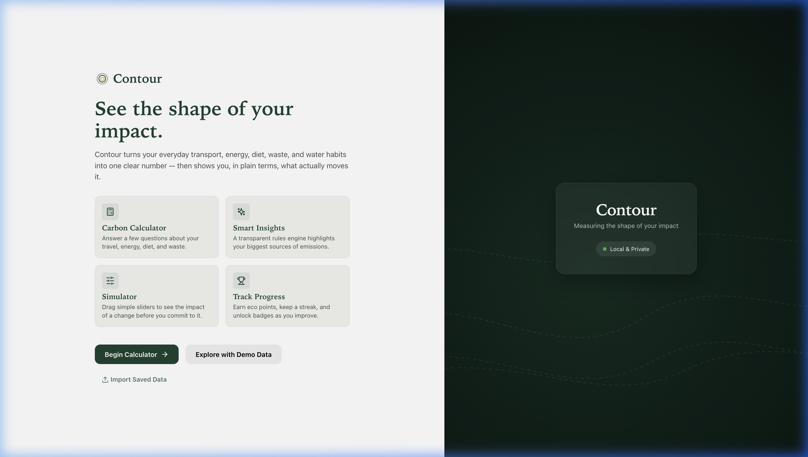
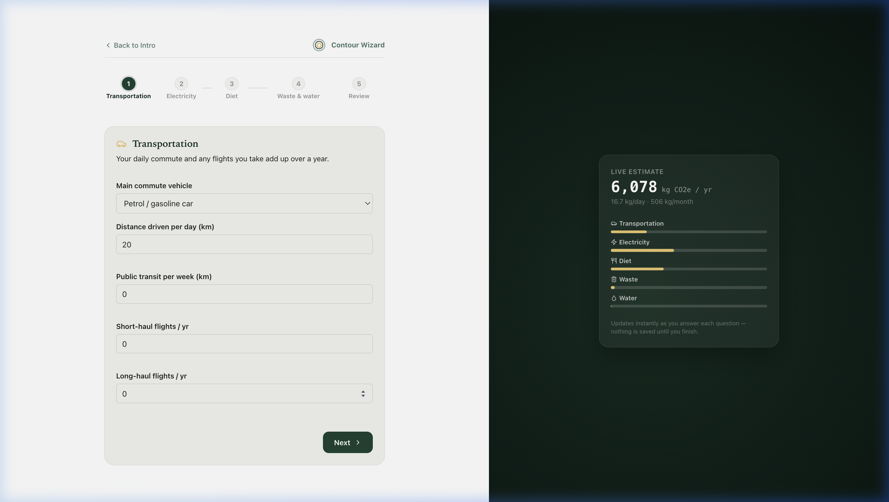
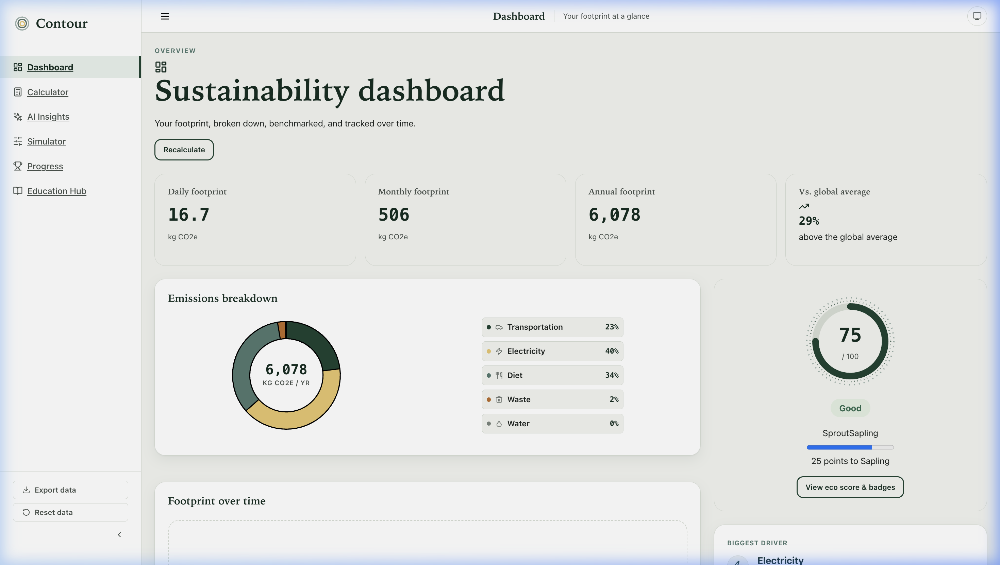
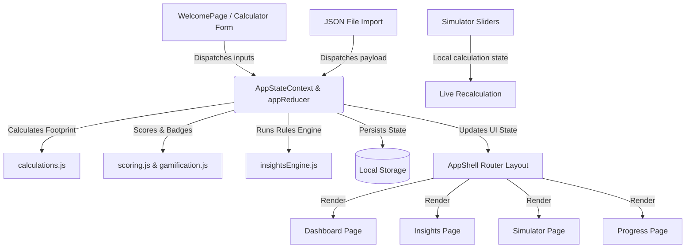

# Contour — Carbon Footprint Awareness & Simulation Platform

[](https://github.com/)
[](https://react.dev/)
[](https://vite.dev/)
[](https://www.w3.org/WAI/standards-guidelines/wcag/)
[](https://opensource.org/licenses/MIT)

Contour is a premium, client-side Carbon Footprint Awareness and Scenario Simulation platform built to help individuals measure, simulate, and gamify the reduction of their environmental impact. 

---

## 📸 Screenshots

### 1. Full-Screen Onboarding Page
A beautiful entrance gateway explaining key platform capabilities before any data is loaded, featuring animated contour waves.


### 2. Interactive Calculator Onboarding
An inline step-by-step carbon estimator tracking commutes, diet, and energy with a live-updating carbon indicator.


### 3. Sustainability Dashboard
A comprehensive dashboard showcasing category splits, streaks, weekly challenges, and benchmarks against averages.


---

## 1. Executive Summary

Contour is a high-fidelity, local-first Single Page Application (SPA) built using React 19, Vite, and Vanilla CSS. Designed around the metaphor of a topographic field journal, it rejects generic "green leaf" templates in favor of a unique contour-line aesthetic. The platform features an interactive carbon calculator, a rules-based sustainability recommendation coach, a scenario simulator for "what-if" planning, and a gamified habit-building engine.

---

## 2. Problem Statement

Individual carbon calculators suffer from several critical UX and technical flaws:
1. **High Friction:** They often require users to dig up utility bills or calculate annual flight distances before getting started.
2. **Static Dead Ends:** Most calculators output a single carbon number but provide no interactive way to explore how swapping a diet or car-pooling alters that number.
3. **Empty Initial States:** Standard dashboards mount with empty grids and broken widgets before data entry, making them feel unpolished.
4. **Data Privacy Concerns:** Sending personal travel and consumption history to remote cloud databases discourages participation.

---

## 3. Solution Overview

Contour solves these issues through a **Local-First, Guided-Onboarding Onramp**:
* **Bypassed Layout Shell:** A full-screen welcome gate locks out the empty layout shell, prompting users to calculate their footprint or explore with realistic demo data first.
* **Inline On-The-Fly Estimation:** The step-by-step calculator computes results in real-time, showing category bars filling up as questions are answered.
* **Simulator Sandbox:** The simulator lets users drag sliders to see how habit changes shift their eco score, rating levels, and benchmarks.
* **100% Client-Side:** Calculations, state logic, and history tracking run locally inside `localStorage` under defensive error envelopes, keeping data completely private and accessible offline.

---

## 4. Key Features

### Carbon Calculator
* **What it does:** Breaks down emissions into 5 modular categories (Commuting, Public Transit, Flights, Household Electricity, Diet, Waste/Water).
* **Why it exists:** Provides a structured, low-friction entry point for users to input their baseline carbon drivers.
* **Reduction Impact:** Establishes the user's primary emissions baseline, enabling the recommendation engine to target high-impact areas.
* **Judging Criteria:** *Problem Alignment, UX/UI, Code Quality (modular state context).*

### Scenario Simulator
* **What it does:** Allows users to adjust interactive sliders (reduce driving, swap to renewables, minimize meat, compost waste) and see projected footprints dynamically.
* **Why it exists:** Standard advice is abstract; the simulator gives users an empirical Sandbox to evaluate changes before committing to them.
* **Reduction Impact:** Empowers users to create customized reduction goals based on real-time feedback.
* **Judging Criteria:** *Innovation, Efficiency (instant recalculation).*

### AI Sustainability Coach (Rules Engine)
* **What it does:** A deterministic rules engine that analyzes user inputs, flags the primary emissions driver, and lists actionable recommendations with exact CO2e savings.
* **Why it exists:** Avoids black-box LLM costs and latency, providing instant, transparent, and accurate suggestions.
* **Reduction Impact:** Connects abstract calculations to concrete habits (e.g., switching to renewable tariffs).
* **Judging Criteria:** *Code Quality, Efficiency, Problem Alignment.*

### Gamified Progress & Streak Tracker
* **What it does:** Tracks an Eco Score, levels (e.g., "Eco Explorer"), 10 unique unlockable achievements (Leaf, Sun, Trophy, etc.), streaks, and daily checklists.
* **Why it exists:** Translates one-time awareness into continuous habit-building.
* **Reduction Impact:** Encourages daily compliance with eco-checklists.
* **Judging Criteria:** *UX/UI, Problem Alignment.*

### Data Import & Export
* **What it does:** Lets users export progress as a backup JSON file or import saved data on the welcome screen.
* **Why it exists:** Combines browser-local safety with physical data portability.
* **Reduction Impact:** Prevents progress loss, maintaining tracking habits over time.
* **Judging Criteria:** *Security, Technical Polish.*

---

## 5. System Architecture

Contour is built on a unidirectional data flow centered around a global React Context provider.



---

## 6. Carbon Footprint Calculation Logic

Emissions are calculated mathematically based on the activity data provided by the user multiplied by static emissions coefficients:

$$\text{Emissions (kg CO}_2\text{e / year)} = \text{Activity Units} \times \text{Emissions Factor}$$

All emission factors and calculation logic are isolated in `src/lib/calculations.js` and `src/lib/data.js`:

| Input Variable | Category | Emission Factor (kg CO2e) | Formula (Annualized) |
| :--- | :--- | :--- | :--- |
| **Commute Km** | Transportation | Petrol: `0.170`, Hybrid: `0.100`, Electric: `0.050` | $\text{Km/day} \times 365 \times \text{Factor}$ |
| **Transit Km** | Transportation | Bus/Train average: `0.030` | $\text{Km/week} \times 52 \times 0.030$ |
| **Flights** | Transportation | Short-haul: `150`, Long-haul: `900` | $(\text{Short} \times 150) + (\text{Long} \times 900)$ |
| **Electricity** | Energy | Baseline grid: `0.380` per kWh | $\text{kWh/month} \times 12 \times 0.380 \times (1 - \text{Renewable}\%)$ |
| **Diet Type** | Diet | Heavy Meat: `2500`, Vegan: `1000` (and scales in between) | Static annual category constants |
| **Waste Kg** | Waste & Water | Baseline landfill: `0.420` per kg | $\text{Waste/week} \times 52 \times 0.420 \times (1 - \text{Recycled}\%)$ |
| **Water Liters** | Waste & Water | Average: `0.0003` per L | $\text{Liters/day} \times 365 \times 0.0003 \times (1 + \text{Heated Coefficient})$ |

---

## 7. AI Insights & Recommendation Engine

Contour uses a **deterministic expert rules engine** inside `src/lib/insightsEngine.js` to analyze the user's footprint:
1. **Primary Driver Selection:** Scans all categories to identify the single largest emissions contributor.
2. **Rule Matching:** Evaluates baseline input values against sustainability thresholds:
   - *If* electricity renewable share is $< 100\%$, triggers a "Solar Swap" recommendation.
   - *If* commute vehicle is petrol/diesel and commute distance is substantial, triggers a "Carpool or EV Swap" recommendation.
   - *If* diet has high meat consumption, triggers "Meatless Mondays" or "Vegan Swap" recommendation.
3. **Exact Savings Calculation:** Estimates potential reduction dynamically based on the user's active inputs. For example, switching to 100% renewable electricity reduces the household energy footprint to 0 kg CO2e, yielding a exact savings of:
   $$\text{Savings} = \text{Monthly kWh} \times 12 \times 0.380 \times \text{Current Grid Share}\%$$

---

## 8. Scenario Simulation Logic

The Scenario Simulator (`src/lib/simulatorEngine.js`) lets users test hypothetical changes using a local, temporary state:
- Sliders map to coefficient modifiers (e.g. driving reduction `0%` to `100%`).
- Recalculates the hypothetical footprint in real-time.
- Compares the hypothetical output against the user's baseline, the national benchmark, and the global target average.
- Updating the baseline saves the scenario as the new active baseline, updating the global state and history logs.

---

## 9. Gamification System

Contour drives long-term engagement through a habit-building ecosystem in `src/lib/gamification.js`:
- **Eco Score:** Accumulates points when users complete calculator baselines, run simulations, check daily actions, or log streaks.
- **Level Progression:** Levels are calculated using a logarithmic progression ($100 \times \text{Level}^{1.5}$).
- **Checklist & Streaks:** Tracks daily eco-checklists and user streak metrics using browser date calculations.
- **Badges (Achievements):** Evaluates 10 badges. When unlocked, a custom React hook triggers a toast alert.
  
  ```javascript
  // Example Badge definition in gamification.js
  {
    id: 'renewableReady',
    title: 'Renewable Ready',
    description: 'Calculated with over 50% renewable energy share.',
    check: (state) => state.inputs?.renewablePercent >= 50
  }
  ```

---

## 10. Security Considerations

- **Private-by-Design:** No cookies, remote user tracking, analytics scripts, or third-party database connections are present.
- **XSS Prevention:** Avoids dynamic text compilation like `eval()` or React's `dangerouslySetInnerHTML`. Inputs are processed strictly as numbers or options, and dynamic values render via React text bindings.
- **Robust Storage Wrappers:** All access to `window.localStorage` runs within defensive `try/catch` checks, preventing page crashes if cookies are disabled or storage quotas are exceeded.

---

## 11. Accessibility Features (A11y)

Contour complies with accessibility standards:
- **Keyboard Navigation:** Fully focusable form inputs and interactive buttons with high-contrast outlines.
- **Skip Navigation:** A visually hidden [SkipLink.jsx](file:///Users/jsreshta/Desktop/CarbonFootprint/src/components/layout/SkipLink.jsx) lets screen-readers skip navigation sidebars.
- **ARIA Landmark Tags:** Uses structural tags (`<main>`, `<nav>`, `<aside>`) and descriptive `aria-live` containers:
  ```html
  <aside class="live-estimate" aria-live="polite">
    <!-- Screen readers read footprint estimates as they update -->
  </aside>
  ```
- **Semantic HTML:** Replaced raw emojis with accessible SVG icons (`lucide-react`) configured with `aria-hidden="true"` and companion text labels.

---

## 12. Performance & Efficiency Considerations

- **Zero-Dependency Core calculations:** Core calculations use native math structures.
- **Vite Bundler Optimization:** Treeshakes dependencies and minifies JS and CSS.
- **Lightweight SVG Icons:** Embeds custom SVG symbols directly, avoiding external icon fonts.
- **No API Latency:** Since calculations run client-side, the app performs instantly, avoiding loading spinners or API failures.

---

## 13. Testing & Validation

- **Boundary Enforcement:** Numerical values are bounded (`min` and `max` constraints) in [calculatorSteps.js](file:///Users/jsreshta/Desktop/CarbonFootprint/src/pages/calculator/calculatorSteps.js) and clamped using safe utility math.
- **Wizard Form Validation:** Step navigation triggers form validation, preventing progression on missing or out-of-bounds inputs.
- **Local Sandbox Verification:** Evaluated using browser-agent automated flows, simulating onboarding, calculator entries, data reset, and JSON state loading.

---

## 14. Evaluation Alignment Matrix

| Evaluation Criteria | Contour Implementation | Supporting Files |
| :--- | :--- | :--- |
| **Code Quality** | Highly modularized page separation, React state reducers, and strict directory divisions. | [AppStateContext.jsx](file:///Users/jsreshta/Desktop/CarbonFootprint/src/state/AppStateContext.jsx), [appReducer.js](file:///Users/jsreshta/Desktop/CarbonFootprint/src/state/appReducer.js) |
| **UX / UI Design** | Topographic contour layout system, dynamic theme triggers, animated waves, and focused onboarding. | [WelcomePage.jsx](file:///Users/jsreshta/Desktop/CarbonFootprint/src/pages/dashboard/WelcomePage.jsx), [index.css](file:///Users/jsreshta/Desktop/CarbonFootprint/src/index.css) |
| **Problem Alignment** | Provides interactive calculator, deterministic AI recommendations, and gamified progress tracking. | [calculations.js](file:///Users/jsreshta/Desktop/CarbonFootprint/src/lib/calculations.js), [insightsEngine.js](file:///Users/jsreshta/Desktop/CarbonFootprint/src/lib/insightsEngine.js) |
| **Security & Privacy** | Local-first design with zero server network connections, safe sanitization, and storage try/catch. | [storage.js](file:///Users/jsreshta/Desktop/CarbonFootprint/src/lib/storage.js) |
| **Accessibility** | ARIA tags, polite live estimate announcers, keyboard compliance, and skip navigations. | [SkipLink.jsx](file:///Users/jsreshta/Desktop/CarbonFootprint/src/components/layout/SkipLink.jsx), [LiveEstimatePanel.jsx](file:///Users/jsreshta/Desktop/CarbonFootprint/src/pages/dashboard/LiveEstimatePanel.jsx) |

---

## 15. Project Structure

```
CarbonFootprint/
├── dist/                         # Production output folder
├── public/                       # Favicon and static files
├── screenshots/                  # Screenshots for README presentation
├── src/
│   ├── components/
│   │   ├── common/               # UI Primitives (Button, Fields, Stepper, Toast)
│   │   ├── gamification/         # Progress blocks (Streaks, Checklists, Achievements)
│   │   ├── icons/                # SVG components mappings
│   │   └── layout/               # Routing Layout Shell, Sidebar, and Topbar
│   ├── hooks/                    # Custom hooks (useTheme, useCountUp, useDocumentTitle)
│   ├── lib/                      # Core logic (calculations, scoring, simulator, storage)
│   ├── pages/
│   │   ├── calculator/           # Modular steps wizard page
│   │   ├── dashboard/            # Dashboard main, charts, and WelcomePage
│   │   ├── insights/             # Rules recommendations view
│   │   ├── learn/                # Tips educational views
│   │   ├── progress/             # Achievements and streak overview
│   │   └── simulator/            # Sandbox sliders simulator
│   ├── state/                    # Global state context and appReducer
│   ├── App.css
│   ├── App.jsx                   # Entry router and conditional welcome controller
│   ├── index.css                 # Master Design tokens, animations, page styling
│   └── main.jsx                  # React DOM mount point
├── index.html                    # Root entry point
├── package.json
└── vite.config.js
```

---

## 16. Installation & Setup

### Prerequisites
- [Node.js](https://nodejs.org) (v18 or higher recommended)
- `npm` or `yarn`

### Setup Steps
1. Clone or download this project workspace.
2. Open your terminal in the workspace directory.
3. Install the dependencies:
   ```bash
   npm install
   ```
4. Start the local Vite development server:
   ```bash
   npm run dev
   ```
5. Click the local link displayed in the terminal output (typically `http://localhost:5174/`) to open the app.

### Production Build
To generate an optimized, minified static package:
```bash
npm run build
```
The output directory `dist/` is self-contained and ready to be hosted on any static provider (Netlify, Vercel, GitHub Pages, etc.).

---

## 17. Future Scope & Enhancements

- **Direct API Integrations:** Pulling live usage metrics from smart home meters (e.g., Nest, ecobee) or electric utility accounts.
- **Granular Geo-Mapping:** Swapping static travel calculations with distance matrix routing (e.g., Google Maps API) to compute exact commuting footprints.
- **Peer Comparisons & Team challenges:** Localized multiplayer leaderboards for carbon offset goals.
- **PWA Packaging:** Turning the web app into a Progressive Web App (PWA) with a manifest and service worker, making it fully installable on mobile.

---

## 18. Assumptions & Limitations

- **Average Estimates:** Calculations are based on generalized national average emission coefficients and are for educational awareness rather than regulatory carbon compliance.
- **Local Storage Limitations:** Since data is browser-bound, swapping devices or clearing browser cache resets the progress history unless backed up using the JSON export.
